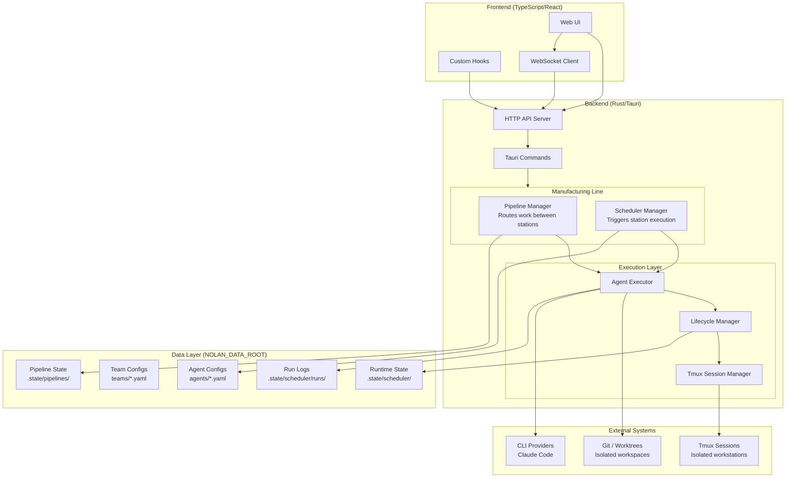
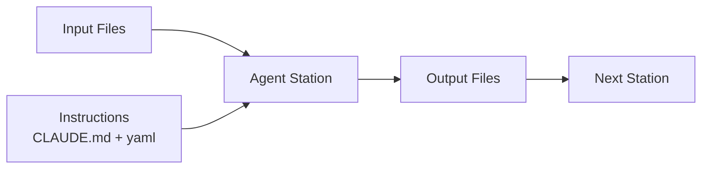
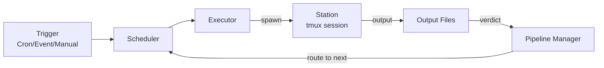
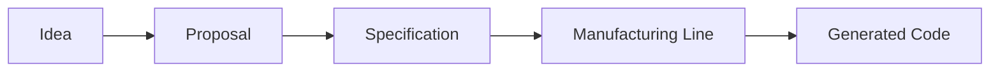

# Nolan System Overview

High-level architecture of Nolan - the AI Manufacturing Line Orchestrator.

## Core Philosophy: Manufacturing Line

Nolan operates like a **manufacturing line**, not a coordination system:

| Concept | Manufacturing Line | Nolan |
|---------|-------------------|-------|
| **Design** | Engineers design stations | Humans design agent workflows |
| **Execution** | Line runs automatically | Agents execute automatically |
| **Flow** | Parts move station to station | Work moves agent to agent |
| **Handoffs** | Programmatic (conveyor) | Programmatic (file-based) |
| **Communication** | None needed | None needed |

**Key principle**: Agents don't coordinate with each other. They receive clear inputs, produce defined outputs, and the system routes work to the next station.

## Component Architecture

## Manufacturing Line Principles

### 1. Clear Inputs & Outputs

Each agent (station) has:
- **Input**: Files, context, or previous station output
- **Instructions**: CLAUDE.md + agent.yaml define the task
- **Output**: Defined deliverables (files, verdicts)

### 2. Isolation

Each station operates in isolation:
- Own tmux session (process isolation)
- Own git worktree (code isolation)
- Own context (no shared state)

### 3. Programmatic Routing

Work flows automatically based on:
- Exit codes (success/failure)
- Output file presence
- Verdict files (structured decisions)

No agent-to-agent communication needed.

## Key Systems

| System | Purpose | Pattern |
|--------|---------|---------|
| **Pipeline Manager** | Routes work through stations | State Machine |
| **Scheduler Manager** | Triggers station execution | Cron + Event |
| **Agent Executor** | Runs individual stations | Process Manager |

## Data Flow

## What Nolan Is NOT

- **Not a coordination system**: Agents don't talk to each other
- **Not event-driven messaging**: No pub/sub between agents (though under evaluation)
- **Not requiring human intervention for handoffs**: Work flows automatically

## Human Role

Humans **design the manufacturing line**:
- Define agents (stations) in YAML
- Define workflows (line layout) in team configs
- Define quality gates (inspection points)

The line **executes automatically**:
- Scheduler triggers stations
- Pipeline routes work
- Output files flow to next station

## Future: Spec-Driven Development

Nolan is evolving toward **spec-driven development** where:

- **Specs** (natural language) become the source of truth
- **Code** becomes a generated artifact, not human-authored
- **Manufacturing line** executes specs automatically

See `07-spec-driven-architecture.md` for the spec layer architecture (Phase 6).
