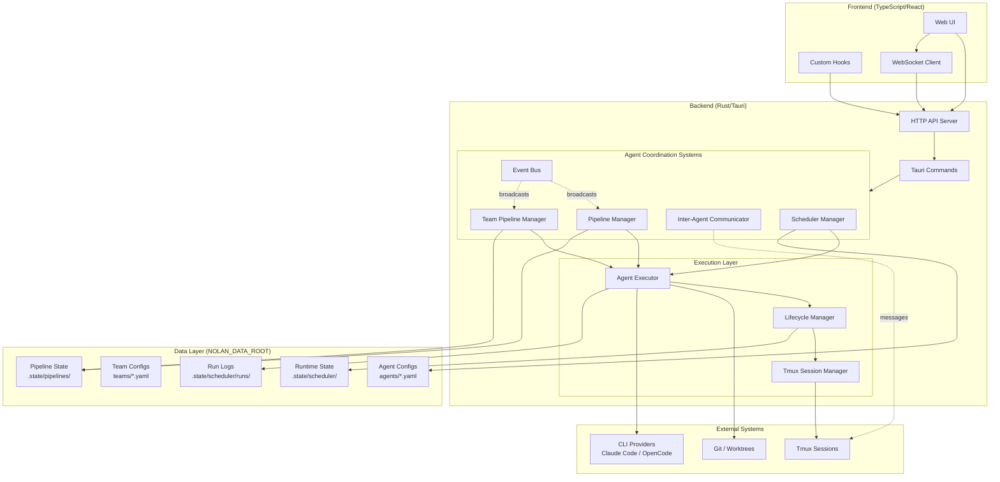
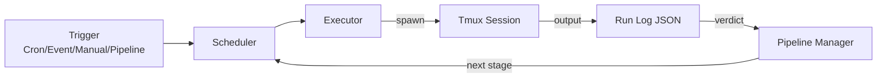

# Nolan System Overview

High-level architecture of Nolan - the AI Multi-Agent Orchestrator.

## Component Architecture

## Key Coordination Systems

| System | Purpose | Pattern | File |
|--------|---------|---------|------|
| **Pipeline Manager** | 4-stage agent workflow (Impl→Analyze→QA→Merge) | State Machine | `scheduler/pipeline.rs` |
| **Team Pipeline** | Multi-phase team workflows | Hierarchical State Machine | `scheduler/team_pipeline.rs` |
| **Event Bus** | System-wide event pub/sub | Publish-Subscribe | `events/bus.rs` |
| **Communicator** | Direct agent-to-agent messaging | Point-to-Point + Broadcast | `commands/communicator.rs` |
| **Scheduler** | Time and event-triggered execution | Cron + Event Triggers | `scheduler/manager.rs` |

## Data Flow Summary

