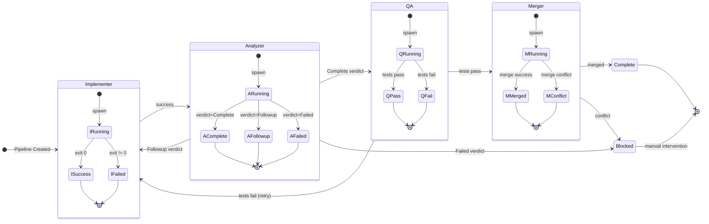
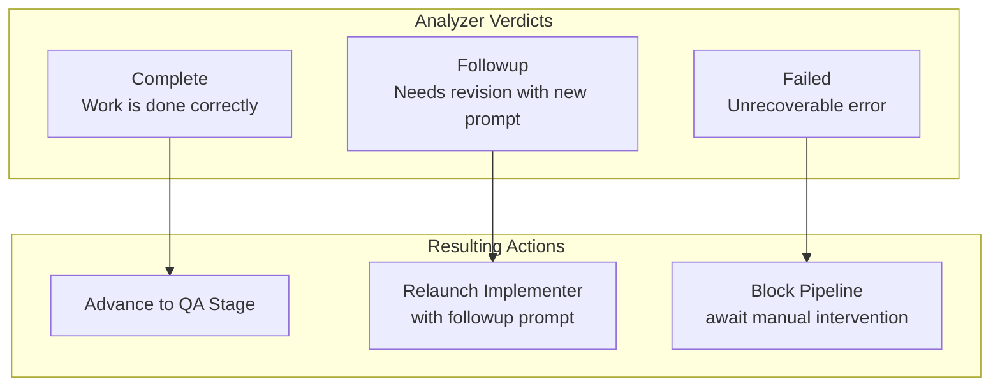
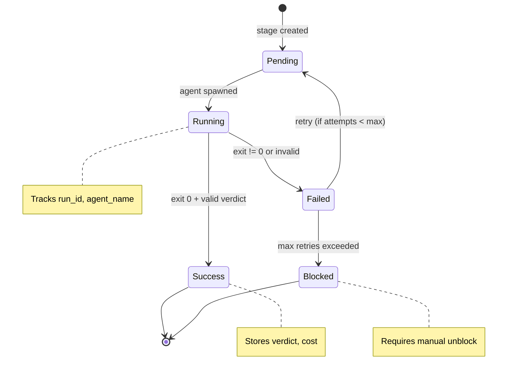
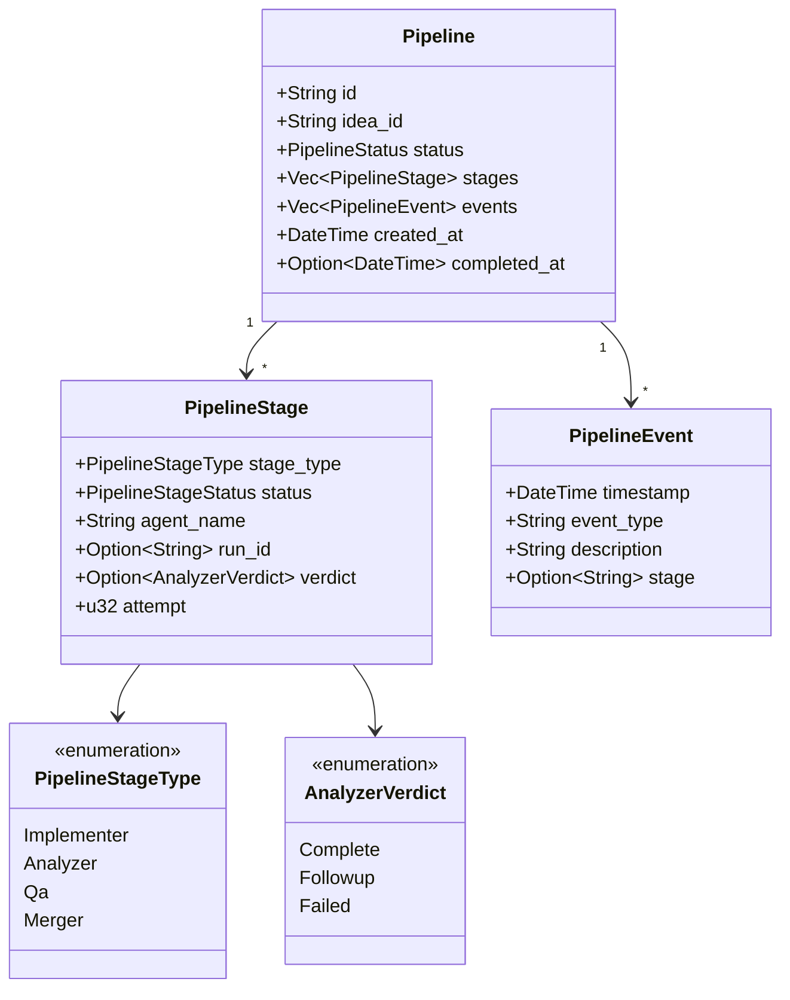
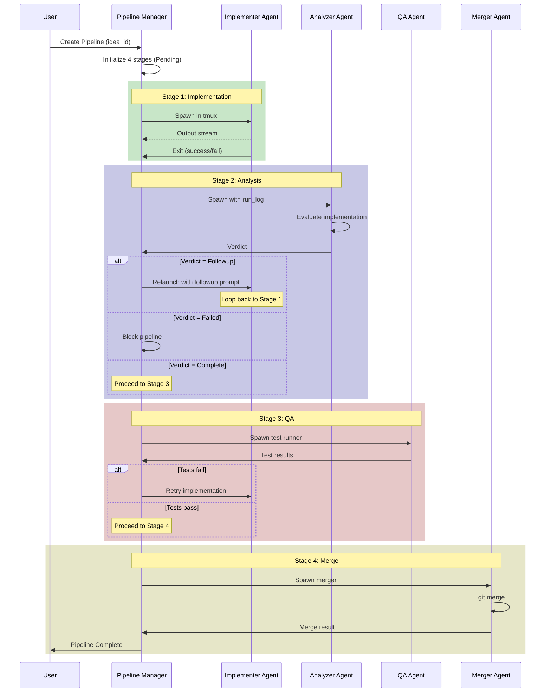

# Agent Pipeline Coordination

**File:** `src-tauri/src/scheduler/pipeline.rs`

The Pipeline Manager implements a CI/CD-inspired 4-stage workflow for individual feature implementation. Each stage has a verdict-driven state machine that controls progression.

## Pipeline Stages

## Verdict-Driven Transitions

The Analyzer produces one of three verdicts that control the workflow:

## Stage Status State Machine

Each stage has its own status tracking:

## Pipeline Data Structure

## Coordination Pattern: Sequential with Feedback Loop

## Key Characteristics

| Aspect | Description |
|--------|-------------|
| **Pattern** | Sequential state machine with conditional feedback loops |
| **Trigger** | Idea approval or manual invocation |
| **Progression** | Verdict-driven (Complete/Followup/Failed) |
| **Retry** | Per-stage attempt tracking with max retries |
| **Isolation** | Git worktree per pipeline for branch isolation |
| **Persistence** | JSON state files in `.state/pipelines/` |
