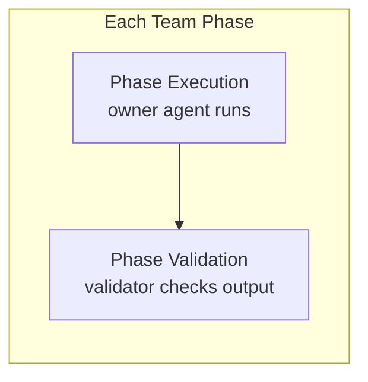
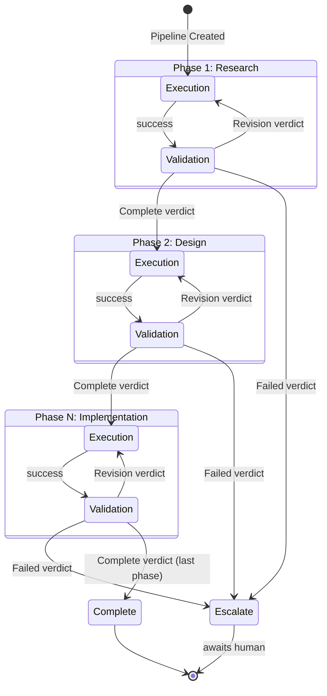
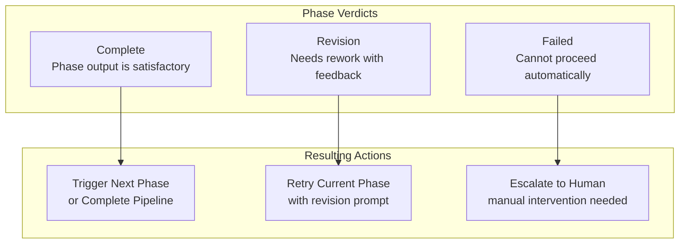
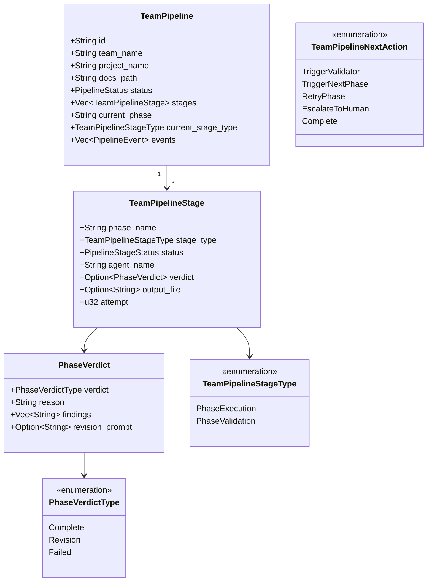
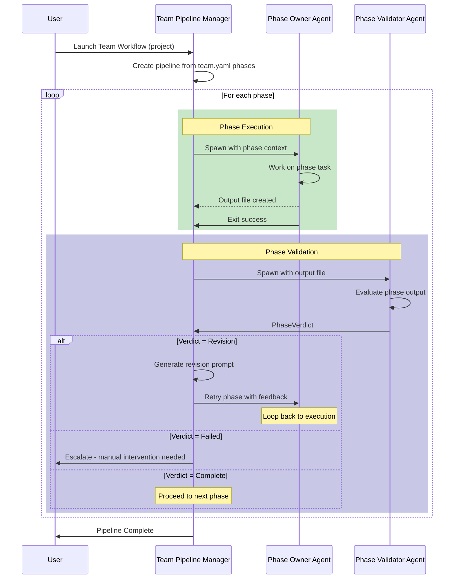
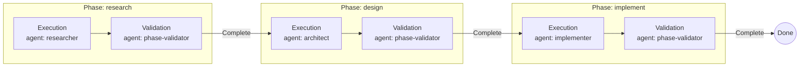

# Team Pipeline Coordination

**File:** `src-tauri/src/scheduler/team_pipeline.rs`

Team Pipelines orchestrate multi-phase workflows defined in `team.yaml`. Unlike the 3-stage Agent Pipeline, Team Pipelines dynamically create stages based on workflow phase definitions, with each phase having an execution and validation sub-stage.

## Phase Structure

Each phase from `team.yaml` is expanded into two sub-stages:



## Team Pipeline State Machine



## Verdict-Driven Transitions

Phase Validators produce one of three verdicts:



## Data Structure



## Coordination Sequence



## Dynamic Phase Expansion Example

Given a `team.yaml` like:

```yaml
workflow:
  phases:
    - name: research
      owner: researcher
      output: research.md
    - name: design
      owner: architect
      output: design.md
    - name: implement
      owner: implementer
      output: code changes
```

The Team Pipeline creates 6 stages:



## Key Differences from Agent Pipeline

| Aspect | Agent Pipeline | Team Pipeline |
|--------|----------------|---------------|
| **Stages** | Configurable (e.g., 3 stages) | Dynamic from team.yaml |
| **Structure** | Linear with feedback | Nested (exec+validate per phase) |
| **Agents** | Role-typed (e.g., Impl/Analyzer/Merger) | Phase owners + validator |
| **Output** | Code changes | Phase output files |
| **Scope** | Single feature | Multi-phase project |
| **Verdict Types** | Complete/Revision/Failed | Complete/Revision/Failed |

## Key Characteristics

| Aspect | Description |
|--------|-------------|
| **Pattern** | Hierarchical state machine (phases → sub-stages) |
| **Trigger** | Team workflow launch command |
| **Progression** | Verdict-driven (Complete/Revision/Failed) |
| **Dynamic** | Stages created from team.yaml at runtime |
| **Persistence** | JSON state files in `.state/team-pipelines/` |
| **Escalation** | Failed verdict triggers human intervention |
