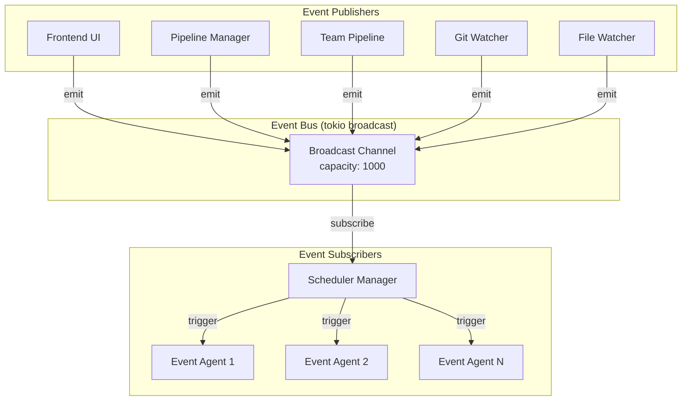
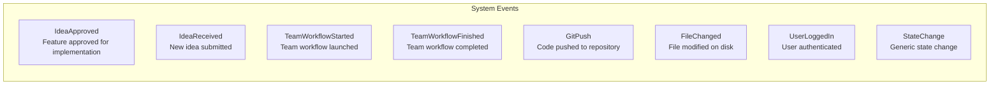
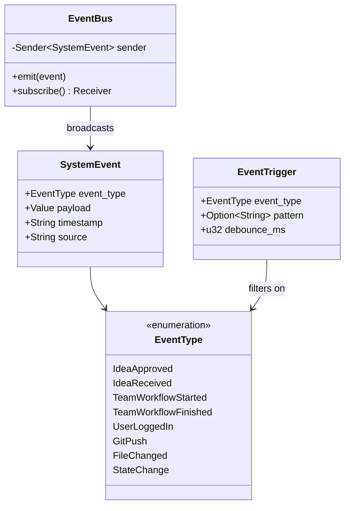
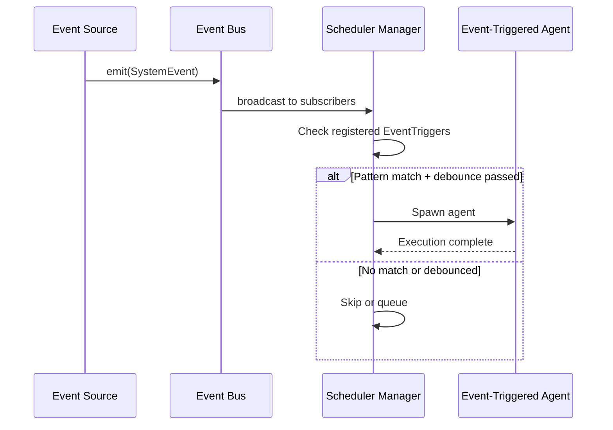
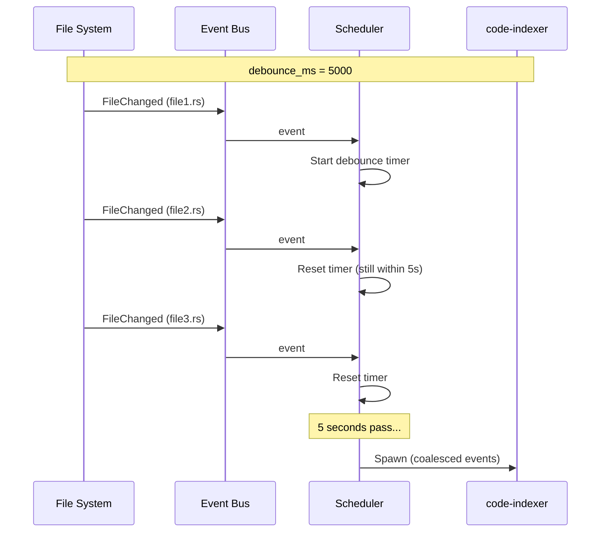

# Event Bus Coordination

> 🔬 **EXPERIMENTAL**: The Event Bus is one of several orchestration approaches under evaluation. It provides pub/sub semantics for reactive agent triggering. See `06-coordination-comparison.md` for comparison with other patterns.

**Files:**
- `src-tauri/src/events/bus.rs` - Event bus implementation
- `src-tauri/src/events/types.rs` - Event types
- `src-tauri/src/scheduler/types.rs` - EventType enum, EventTrigger config

The Event Bus implements a publish-subscribe pattern for system-wide event distribution. Components can emit events and agents can subscribe to trigger on specific event patterns.

## Architecture



## Event Types



## Event Structure



## Event-Triggered Agent Configuration

Agents can subscribe to events via their `agent.yaml`:

```yaml
name: code-indexer
trigger:
  events:
    - event_type: git_push
      debounce_ms: 5000  # Wait 5s after last push
    - event_type: file_changed
      pattern: "*.rs"     # Only Rust files
      debounce_ms: 2000
```

## Event Flow Sequence



## Debounce Mechanism

Events are debounced per-agent to prevent rapid re-triggering:



## Comparison with Direct Triggering

| Aspect | Event Bus | Direct Trigger |
|--------|-----------|----------------|
| **Coupling** | Loose (pub/sub) | Tight (direct call) |
| **Multi-subscriber** | Yes | No |
| **Async** | Native async broadcast | Synchronous |
| **Debounce** | Built-in per-agent | Manual |
| **Pattern matching** | Regex/glob on payload | N/A |
| **Observability** | Central event log | Scattered |

## Key Characteristics

| Aspect | Description |
|--------|-------------|
| **Pattern** | Publish-Subscribe with debouncing |
| **Implementation** | tokio broadcast channel (capacity 1000) |
| **Global instance** | Singleton via `once_cell::Lazy` |
| **Event filtering** | EventType + optional pattern regex |
| **Debounce** | Per-agent configurable (default 1000ms) |
| **Persistence** | Events not persisted (fire-and-forget) |
