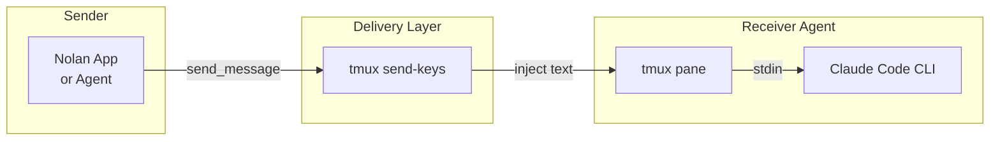
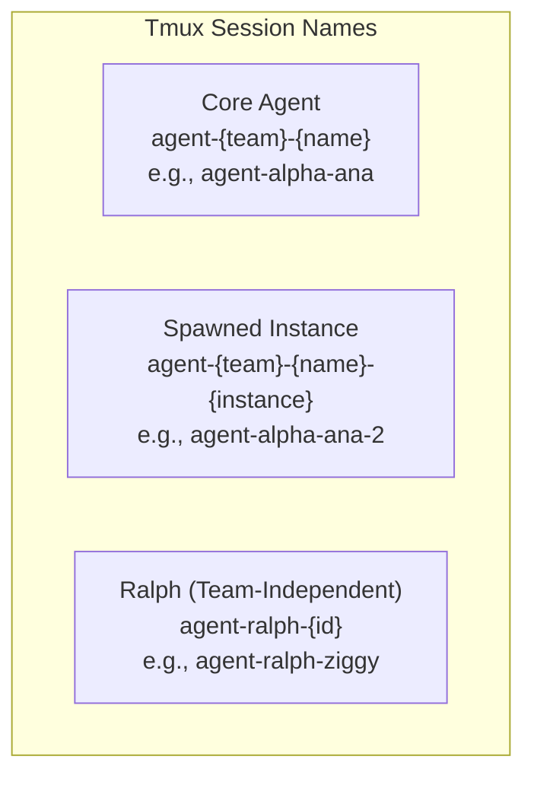
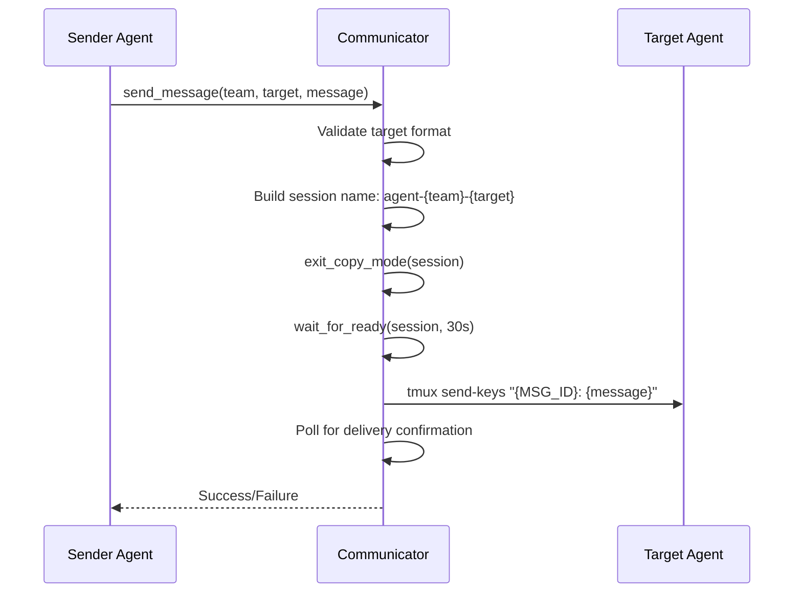
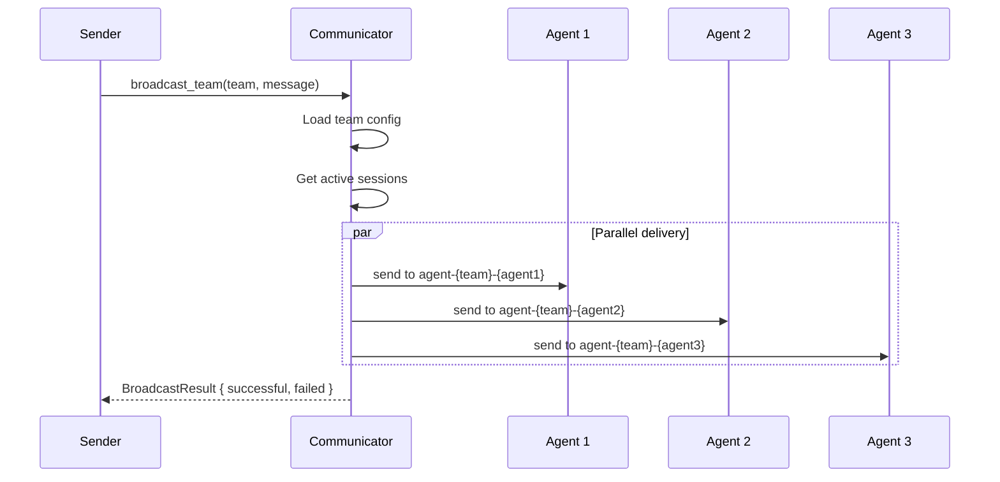
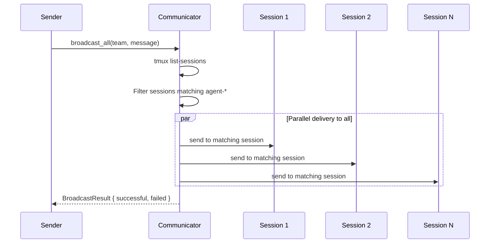
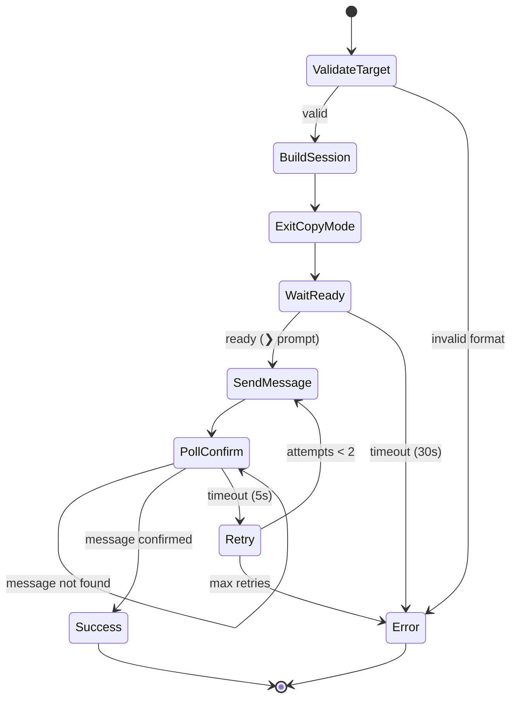
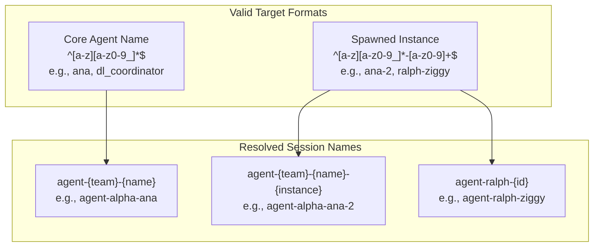
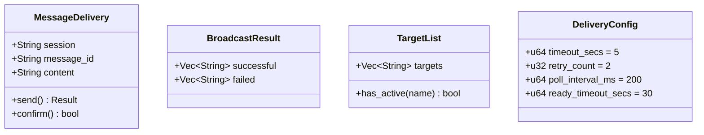

# Inter-Agent Messaging Coordination

> 🔬 **EXPERIMENTAL**: Inter-agent messaging is one of several orchestration approaches under evaluation. It enables direct point-to-point communication between agents via tmux injection. See `06-coordination-comparison.md` for comparison with other patterns.

**File:** `src-tauri/src/commands/communicator.rs`

The Inter-Agent Messaging system enables direct communication between agents via tmux session injection. Unlike the Event Bus (fire-and-forget pub/sub), this system provides point-to-point and broadcast messaging with delivery confirmation.

## Message Delivery Mechanism

Messages are delivered by injecting text directly into tmux panes:



## Message ID Format

Messages are tagged with unique IDs for tracking:

```
MSG_<SENDER>_<8-HEX-CHARS>
```

Examples:
- `MSG_ANALYZER_a1b2c3d4` - Message from analyzer agent
- `MSG_USER_deadbeef` - Message from Nolan app (user)

## Session Naming Conventions



## Messaging Patterns

### Pattern 1: Point-to-Point



### Pattern 2: Team Broadcast



### Pattern 3: All Sessions Broadcast



## Delivery Confirmation

The system waits for the message to appear in the target pane:



## Target Validation Patterns



## Data Structures



## Comparison with Event Bus

| Aspect | Inter-Agent Messaging | Event Bus |
|--------|----------------------|-----------|
| **Pattern** | Point-to-point / Broadcast | Pub/Sub |
| **Delivery** | Confirmed (poll-based) | Fire-and-forget |
| **Target** | Specific session(s) | All subscribers |
| **Medium** | tmux pane injection | tokio broadcast channel |
| **Retry** | Built-in (2 attempts) | None |
| **Scope** | Team-scoped sessions | System-wide |
| **Use case** | Direct coordination | Event triggers |

## Key Characteristics

| Aspect | Description |
|--------|-------------|
| **Pattern** | Point-to-point and broadcast with confirmation |
| **Delivery** | tmux send-keys injection |
| **Confirmation** | Poll pane content for message ID |
| **Timeout** | 5 seconds per delivery, 30s for ready wait |
| **Retry** | 2 attempts on failure |
| **Scope** | Team-scoped (agent-{team}-{name}) |
| **Message ID** | `MSG_{SENDER}_{8-hex}` for tracking |
