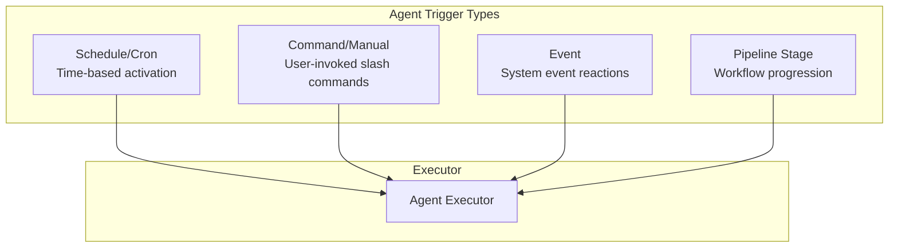
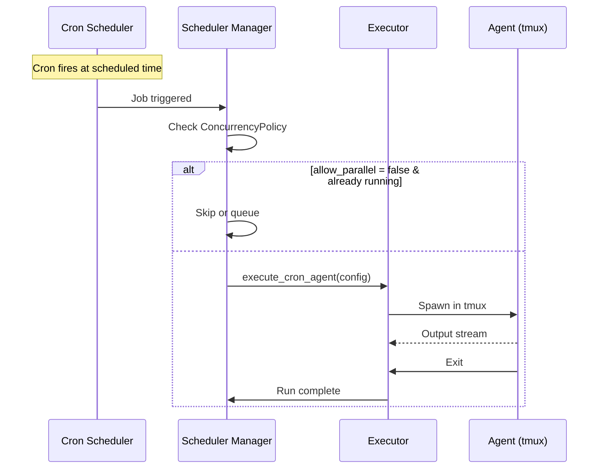
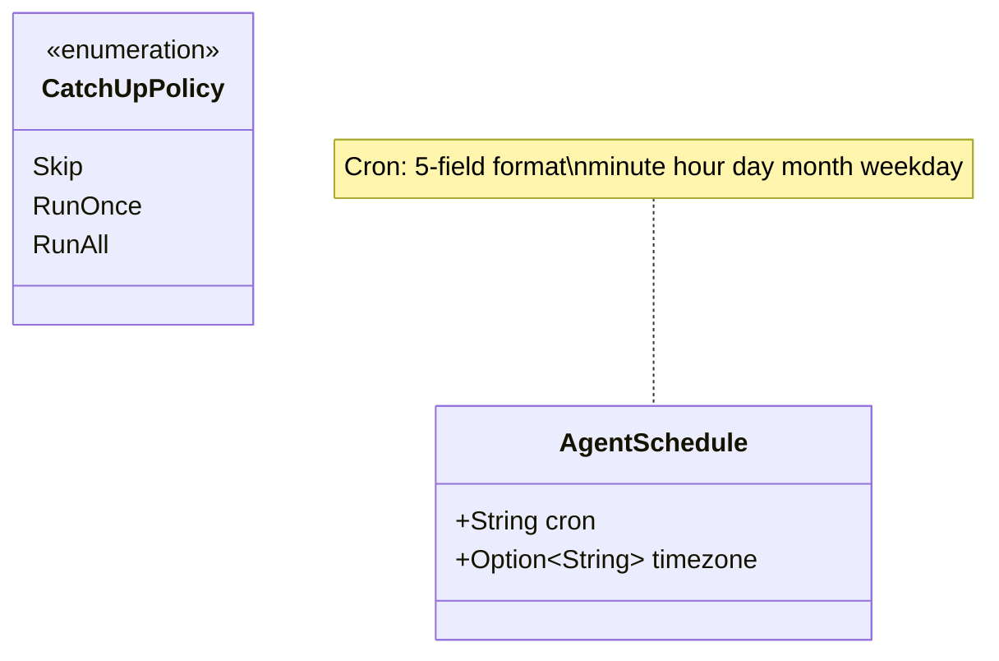
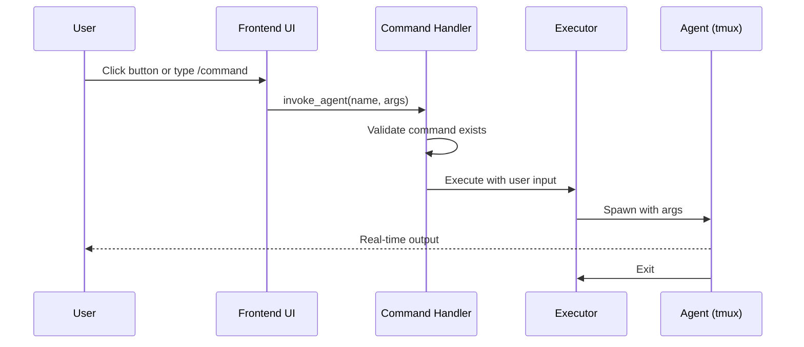
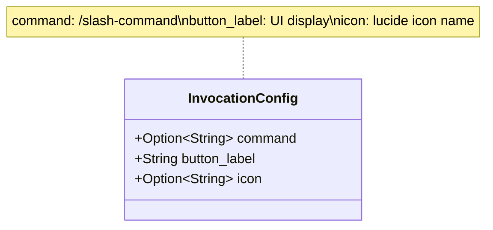
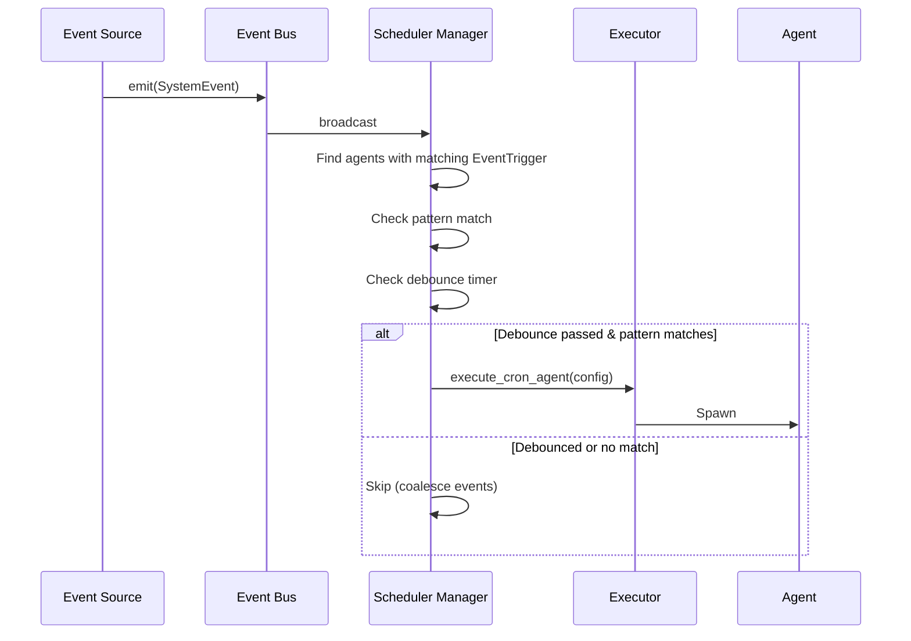
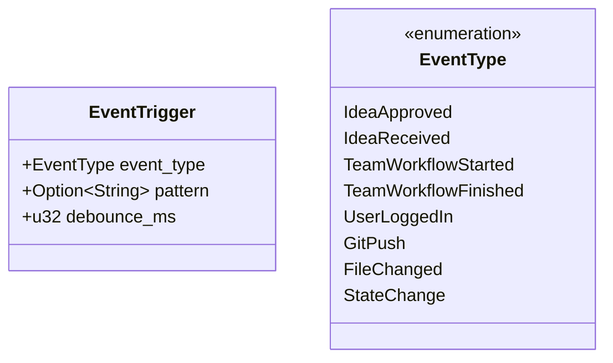
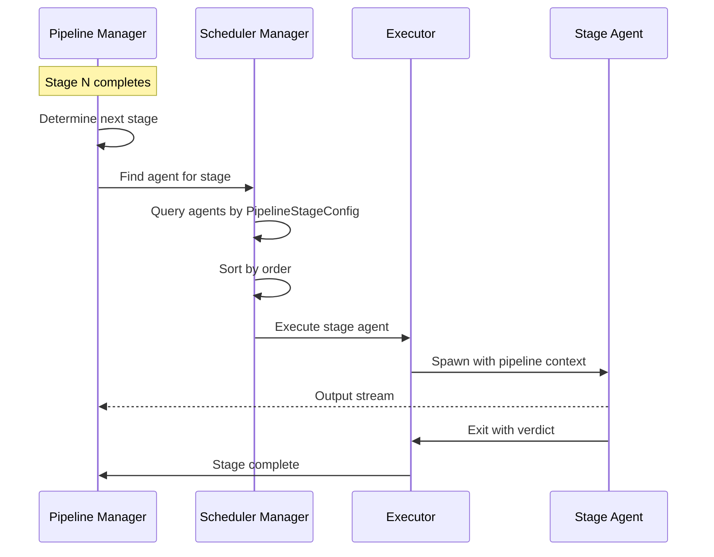
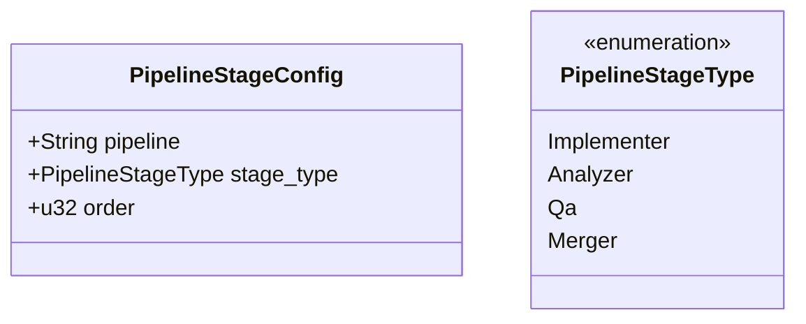
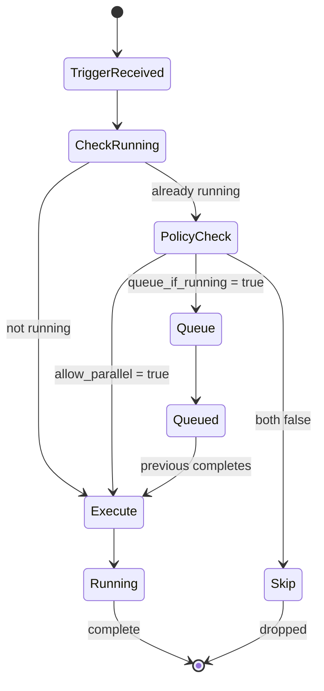

# Agent Trigger System

**Files:**
- `src-tauri/src/scheduler/types.rs` - TriggerConfig, trigger types
- `src-tauri/src/scheduler/manager.rs` - Scheduler Manager
- `src-tauri/src/scheduler/executor.rs` - Agent Executor

The Trigger System provides four distinct mechanisms for activating agents. Each mechanism serves different use cases and can be combined in a single agent configuration.

## Trigger Types Overview



## Trigger Configuration

Each agent can have multiple triggers defined in `agent.yaml`:

```yaml
triggers:
  # Time-based trigger
  schedule:
    cron: "0 9 * * 1"  # Every Monday at 9am
    timezone: "America/New_York"

  # Manual command trigger
  command:
    command: "/security-scan"
    button_label: "Run Security Scan"
    icon: "shield"

  # Event-based triggers (multiple allowed)
  events:
    - event_type: git_push
      debounce_ms: 5000
    - event_type: file_changed
      pattern: "*.rs"
      debounce_ms: 2000

  # Pipeline stage trigger
  pipeline_stage:
    pipeline: "feature-implementation"
    stage_type: Analyzer
    order: 1
```

## Trigger 1: Schedule/Cron



**Configuration:**


## Trigger 2: Command/Manual



**Configuration:**


## Trigger 3: Event-Based



**Configuration:**


## Trigger 4: Pipeline Stage



**Configuration:**


## Combined Trigger Flow

An agent can have multiple triggers. Here's how they're resolved:

```mermaid
flowchart TB
    subgraph Config["Agent Configuration"]
        Legacy[Legacy Fields<br/>schedule, invocation, event_trigger]
        New[TriggerConfig<br/>triggers: {...}]
    end

    subgraph Resolution["effective_triggers()"]
        Merge[Merge legacy + new<br/>New takes precedence]
    end

    subgraph Activation["Activation Paths"]
        A1[Cron Job fires]
        A2[User invokes command]
        A3[Event matches pattern]
        A4[Pipeline advances stage]
    end

    subgraph Executor["Single Executor"]
        Exec[execute_cron_agent]
    end

    Legacy --> Merge
    New --> Merge
    Merge --> A1
    Merge --> A2
    Merge --> A3
    Merge --> A4

    A1 --> Exec
    A2 --> Exec
    A3 --> Exec
    A4 --> Exec
```

## Concurrency Control

All triggers respect the agent's concurrency policy:



**Concurrency Policy:**
```yaml
concurrency:
  allow_parallel: false  # Can multiple instances run?
  queue_if_running: true # Queue trigger if already running?
```

## Trigger Comparison

| Trigger | Activation | Use Case | Timing |
|---------|------------|----------|--------|
| **Schedule** | Cron expression | Periodic maintenance, reports | Predictable |
| **Command** | User action | On-demand tasks | User-initiated |
| **Event** | System event | Reactive automation | Event-driven |
| **Pipeline** | Stage completion | Workflow progression | Pipeline-driven |

## Key Characteristics

| Aspect | Description |
|--------|-------------|
| **Multi-trigger** | Single agent can have multiple trigger types |
| **Legacy support** | Old fields merged with new TriggerConfig |
| **Concurrency** | Per-agent policy (parallel/queue/skip) |
| **Debounce** | Event triggers have configurable debounce |
| **Catch-up** | Cron can skip/run-once/run-all missed jobs |
| **Context** | All triggers pass through same executor |
