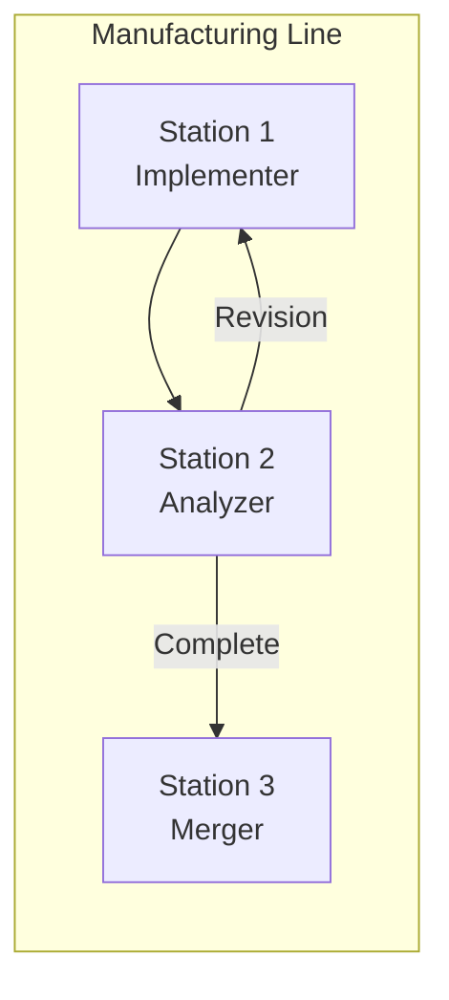
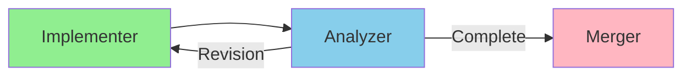
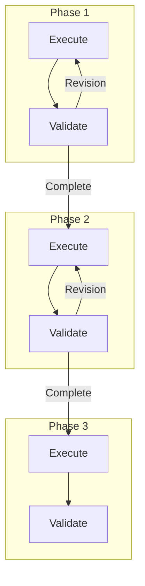
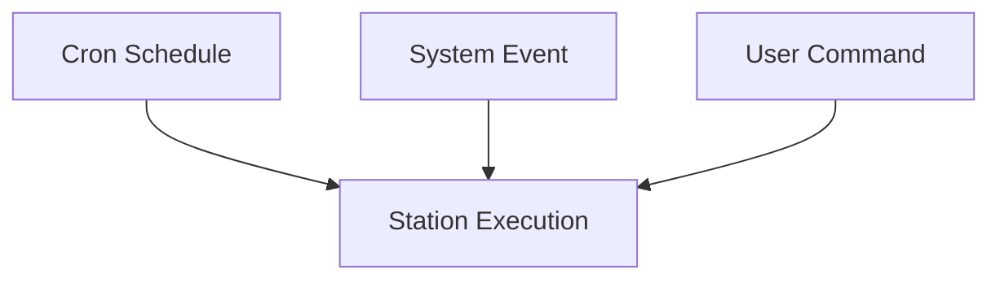
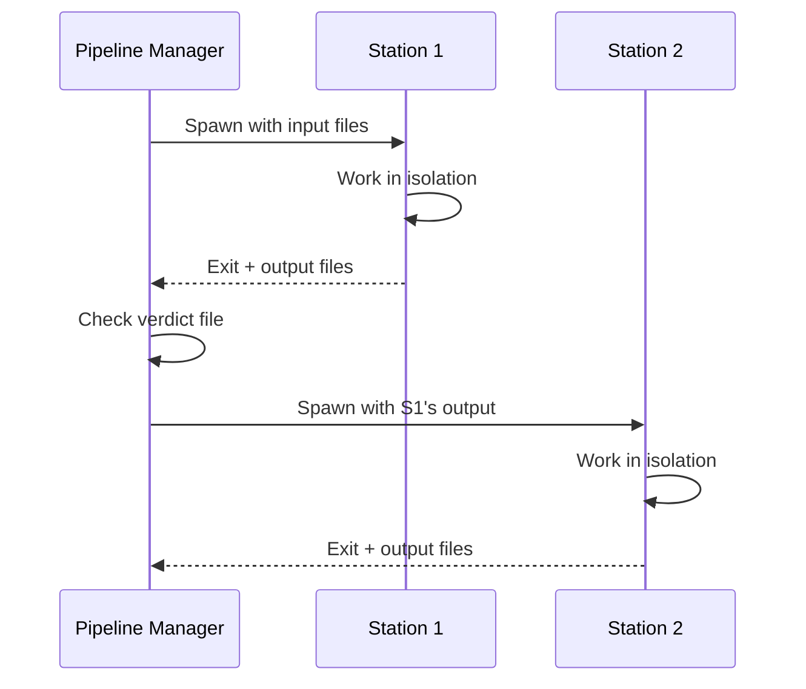

# Agent Execution Systems

This document describes Nolan's manufacturing line approach to agent execution.

## Core Philosophy: Manufacturing Line

Nolan operates like a **manufacturing line**, not a coordination system:

**Key principles:**
1. **Clear instructions**: Each station knows exactly what to do
2. **Isolation**: Stations don't communicate with each other
3. **Programmatic delivery**: Output files flow to the next station automatically
4. **Human designs, line executes**: Humans define the workflow, the system runs it

## Execution Systems

### 1. Pipeline Manager: Configurable Stations

Routes work through a configurable sequence of stations (like CI/CD pipelines).

**Characteristics:**
- Configurable station structure (example shows 3 stations)
- Verdict-driven routing (Complete/Revision/Failed)
- Git worktree isolation per pipeline
- Use case: Feature implementation pipelines

### 2. Team Pipeline: Dynamic Stations

Routes work through configurable phases defined in team.yaml.

**Characteristics:**
- Dynamic phases from team.yaml
- Each phase has execution + validation
- Revision feedback within phases
- Use case: Multi-phase projects (research → design → implement)

### 3. Scheduler: Triggered Execution

Triggers individual stations based on time or events.

**Characteristics:**
- Multiple trigger sources per agent
- Concurrency control
- Debouncing for events
- Use case: Background maintenance tasks

## How Work Flows

Work flows through the line via **files**, not messages:

**No inter-station communication**. Each station:
1. Receives input files
2. Reads instructions (CLAUDE.md + yaml)
3. Produces output files
4. Exits

The Pipeline Manager routes work based on:
- Exit code (0 = success)
- Verdict file content (Complete/Revision/Failed)
- Output file presence

## Comparison with Traditional Coordination

| Aspect | Traditional (Coordination) | Nolan (Manufacturing Line) |
|--------|---------------------------|---------------------------|
| **Agent interaction** | Message passing | None |
| **Work routing** | Event-driven | File-based + state machine |
| **Human role** | Monitor and intervene | Design workflows |
| **Handoffs** | Require acknowledgment | Automatic via files |
| **Failure handling** | Escalate to human | Retry or block station |

## Design Principles

### Humans Design the Line

1. **Define stations** (agents) in YAML with clear inputs/outputs
2. **Define flow** (workflows) in team configs
3. **Define quality gates** (validators) at each phase

### Line Executes Automatically

1. **Scheduler** triggers stations on schedule or events
2. **Pipeline Manager** routes work between stations
3. **Output files** serve as the "conveyor belt"

### Isolation Prevents Problems

- Each station has its own tmux session
- Each pipeline has its own git worktree
- No shared state between stations
- Failures are contained to one station

## Key Files Reference

| System | Primary File |
|--------|-------------|
| Pipeline Manager | `scheduler/pipeline.rs` |
| Team Pipeline | `scheduler/team_pipeline.rs` |
| Scheduler | `scheduler/manager.rs` |
| Executor | `scheduler/executor.rs` |

## Alternative Orchestration Patterns

Nolan is evaluating multiple orchestration approaches. Each has tradeoffs:

| Pattern | Status | Best For |
|---------|--------|----------|
| **Manufacturing Line** | Primary | Predictable workflows with clear stages |
| **Event Bus** | Experimental | Reactive triggers, loose coupling |
| **Inter-Agent Messaging** | Experimental | Direct coordination when needed |

The manufacturing line is the default approach. Event-driven and messaging patterns are under evaluation for specific use cases where reactive behavior or direct communication improves outcomes.

See:
- `03-event-bus-coordination.md` - Pub/sub event system
- `04-inter-agent-messaging.md` - Direct agent communication
