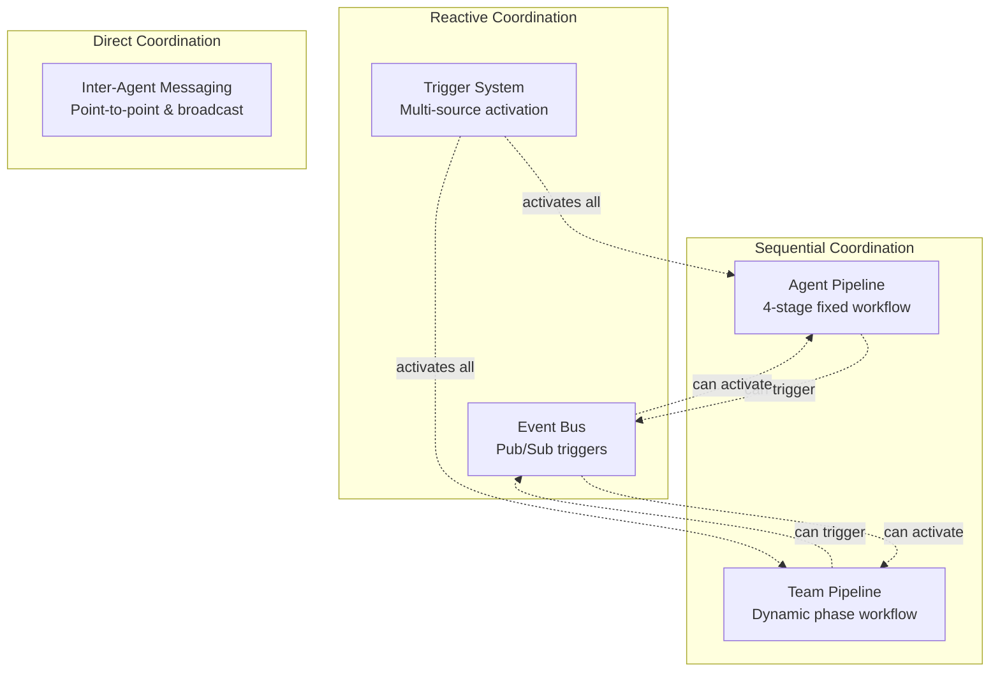
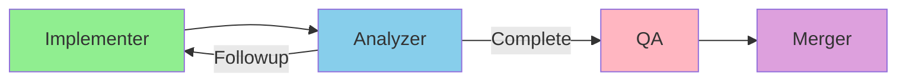
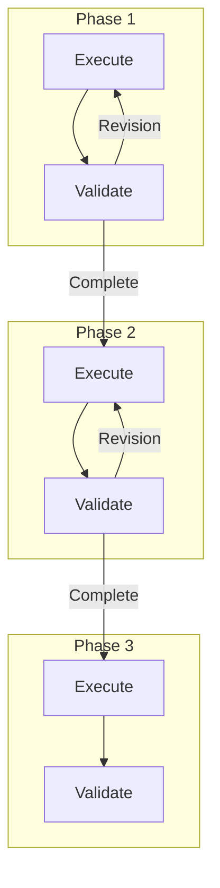
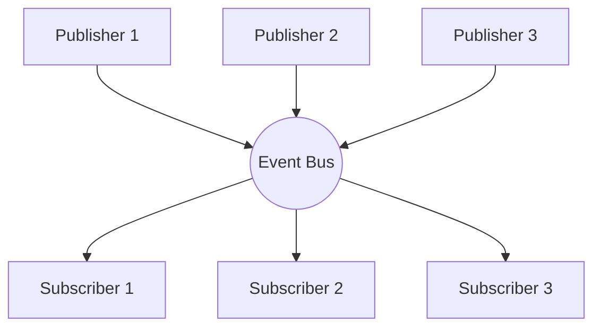
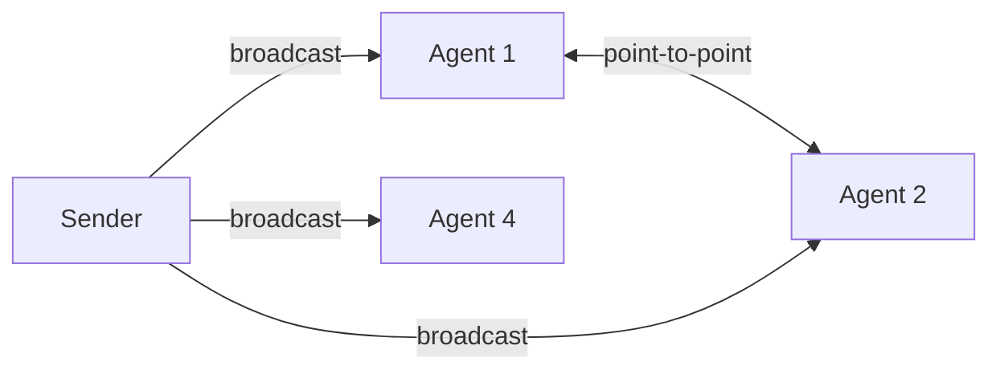
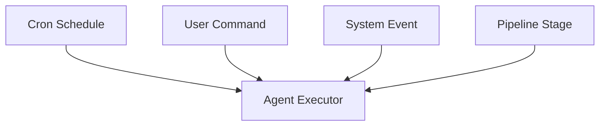
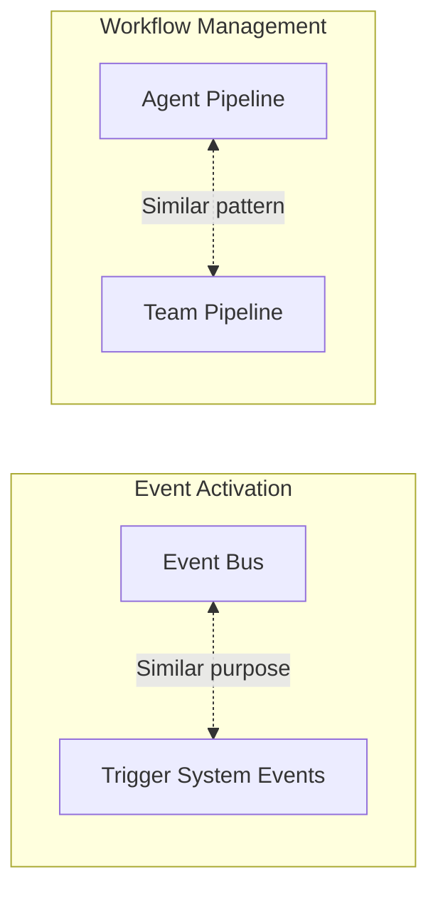
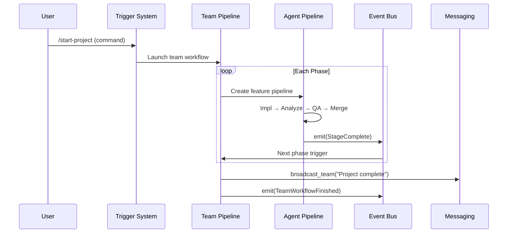
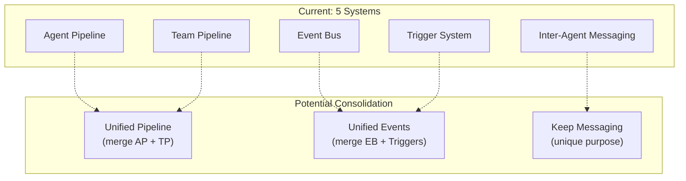

# Agent Coordination Systems Comparison

This document compares the experimental coordination mechanisms in Nolan to help analyze their strengths, weaknesses, and appropriate use cases.

## Overview of Coordination Systems

## Comparison Matrix

| Aspect | Agent Pipeline | Team Pipeline | Event Bus | Inter-Agent Messaging | Trigger System |
|--------|---------------|---------------|-----------|----------------------|----------------|
| **Pattern** | State machine | Hierarchical SM | Pub/Sub | Point-to-point | Multi-source |
| **Coupling** | Tight (stages) | Tight (phases) | Loose | Medium | Loose |
| **Direction** | Unidirectional | Unidirectional | Many-to-many | Any-to-any | Source→Agent |
| **Feedback** | Verdict loop | Revision loop | None | Bidirectional | None |
| **Persistence** | JSON state | JSON state | None | None | Cron jobs |
| **Scope** | Single feature | Multi-phase project | System-wide | Team-scoped | Per-agent |

## Coordination Patterns

### 1. Agent Pipeline: Sequential State Machine

**Characteristics:**
- Fixed 4-stage structure
- Verdict-driven progression (Complete/Followup/Failed)
- Git worktree isolation per pipeline
- Suitable for: Feature implementation with quality gates

### 2. Team Pipeline: Hierarchical Workflow

**Characteristics:**
- Dynamic phases from team.yaml
- Each phase has execution + validation
- Revision feedback within phases
- Suitable for: Multi-phase projects (research → design → implement)

### 3. Event Bus: Pub/Sub Broadcast

**Characteristics:**
- Decoupled publishers and subscribers
- Fire-and-forget delivery
- Debounce per subscriber
- Suitable for: Reactive automation (git push → reindex)

### 4. Inter-Agent Messaging: Direct Communication

**Characteristics:**
- Delivery confirmation (poll-based)
- Team-scoped routing
- Supports both P2P and broadcast
- Suitable for: Explicit agent coordination, handoffs

### 5. Trigger System: Multi-Source Activation

**Characteristics:**
- Multiple activation sources per agent
- Unified execution path
- Concurrency control
- Suitable for: Flexible agent activation

## Experimental Analysis

### Overlap and Redundancy

**Observations:**
1. **Event Bus vs Trigger Events**: Both handle event-based activation. Event Bus is more general-purpose, Trigger System is agent-specific.
2. **Agent vs Team Pipeline**: Both implement staged workflows with feedback. Agent Pipeline is fixed structure, Team Pipeline is configurable.

### Decision Matrix: When to Use What

| Scenario | Recommended System | Reason |
|----------|-------------------|--------|
| Single feature with QA | Agent Pipeline | Fixed quality gates |
| Multi-phase project | Team Pipeline | Dynamic phases |
| React to git changes | Event Bus + Trigger | Loose coupling |
| Agent handoff | Inter-Agent Messaging | Direct coordination |
| Periodic maintenance | Trigger (Cron) | Time-based |
| User-initiated task | Trigger (Command) | Manual control |

### Coordination Flow Example

A complex workflow might use multiple systems:

## Strengths & Weaknesses

### Agent Pipeline
| Strengths | Weaknesses |
|-----------|------------|
| Clear quality gates | Fixed structure |
| Verdict feedback loop | Single feature scope |
| Git worktree isolation | No dynamic phases |

### Team Pipeline
| Strengths | Weaknesses |
|-----------|------------|
| Dynamic from team.yaml | More complex state |
| Phase-level validation | Heavier weight |
| Multi-phase support | Requires team config |

### Event Bus
| Strengths | Weaknesses |
|-----------|------------|
| Fully decoupled | No delivery guarantee |
| Multi-subscriber | Fire-and-forget only |
| System-wide reach | No direct response |

### Inter-Agent Messaging
| Strengths | Weaknesses |
|-----------|------------|
| Delivery confirmation | tmux dependency |
| Bidirectional possible | Team-scoped only |
| P2P and broadcast | Higher latency |

### Trigger System
| Strengths | Weaknesses |
|-----------|------------|
| Unified activation | Complexity of multiple sources |
| Concurrency control | Config overhead |
| Multiple trigger types | No coordination itself |

## Consolidation Opportunities

**Potential simplifications:**
1. **Unified Pipeline**: Merge Agent Pipeline into Team Pipeline as a "single-phase" special case
2. **Unified Events**: Consolidate Event Bus triggers into Trigger System's event mechanism
3. **Keep Messaging**: Inter-Agent Messaging serves a unique purpose (direct coordination)

## Key Files Reference

| System | Primary File | Lines |
|--------|-------------|-------|
| Agent Pipeline | `scheduler/pipeline.rs` | ~34KB |
| Team Pipeline | `scheduler/team_pipeline.rs` | ~21KB |
| Event Bus | `events/bus.rs` | ~66 lines |
| Messaging | `commands/communicator.rs` | ~500 lines |
| Trigger System | `scheduler/types.rs` (TriggerConfig) | Part of 42KB |
