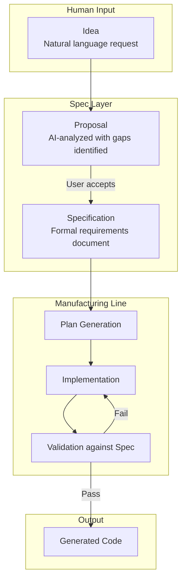
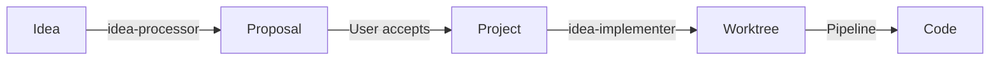
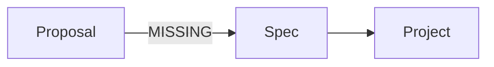
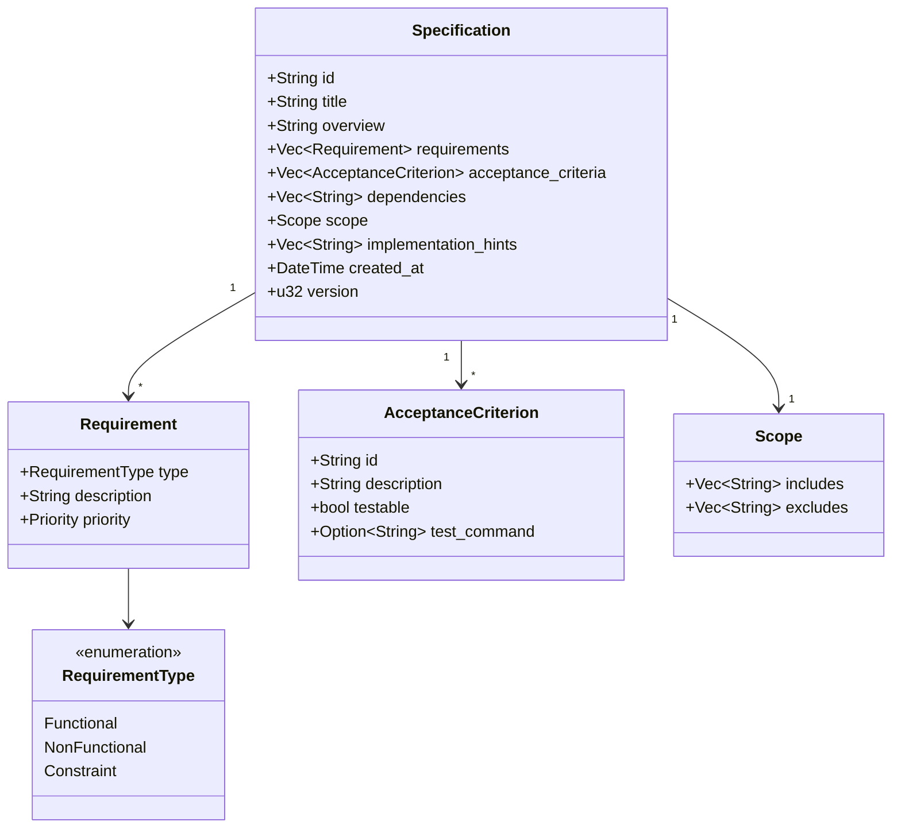
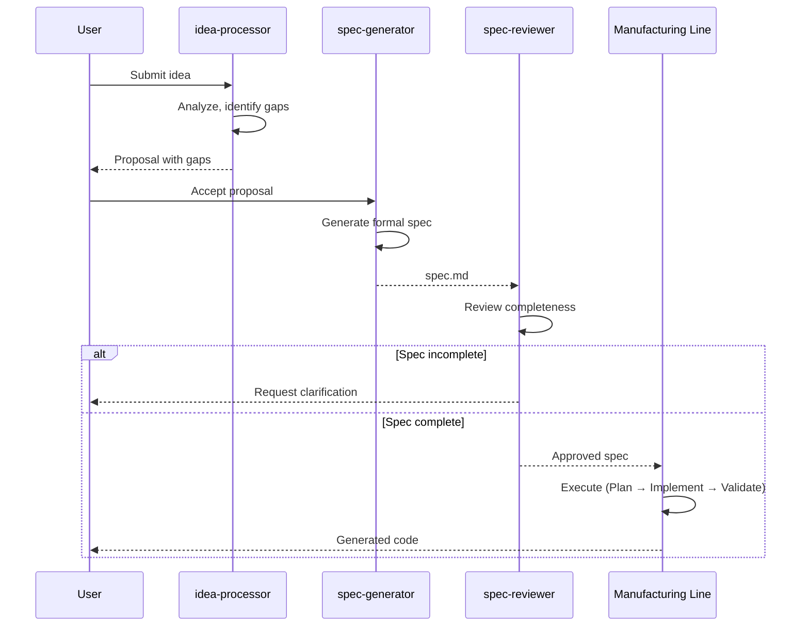
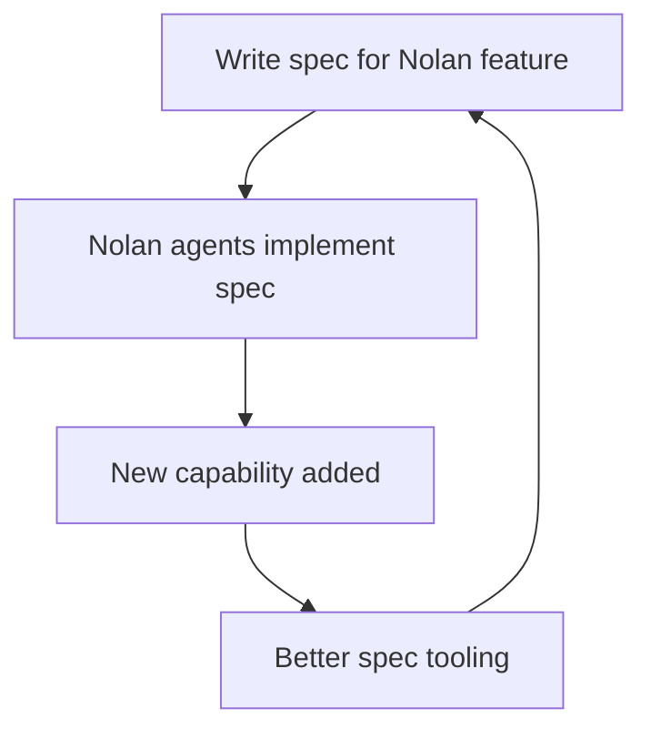
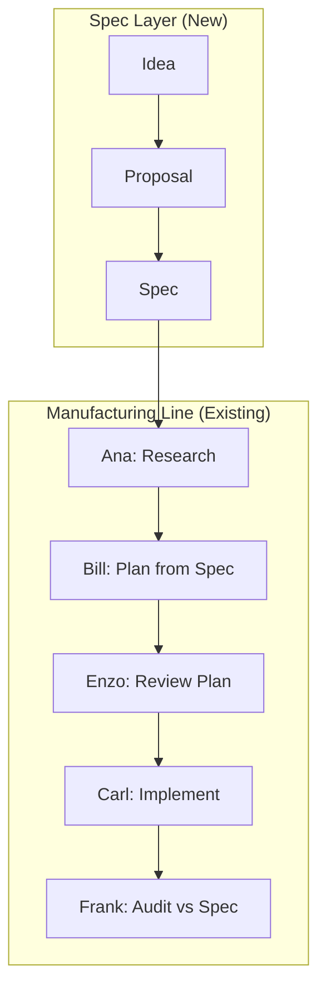

# Spec-Driven Architecture

> **Status**: Phase 6 - In Progress (20%)
>
> This document describes Nolan's evolution toward spec-driven development, where specifications in natural language become the source of truth and code becomes a generated artifact.

## Core Concept



## The Abstraction Jump

| Era | Human Writes | Machine Handles |
|-----|--------------|-----------------|
| 1950s | Assembly | - |
| 1970s | C | Assembly |
| 2000s | JavaScript | Memory, low-level ops |
| 2025+ | **Specs (English)** | **All code** |

Nolan is the platform for this transition. Specs are not documentation - they are executable instructions.

## Current Implementation

### Ideas System (Implemented)

The foundation for spec-driven development exists:

```
~/.nolan/
├── ideas.jsonl           # User-submitted ideas
├── inbox-reviews.jsonl   # AI-generated proposals
└── projects/             # Created from approved ideas
```

**Current Flow:**


**Agents involved:**
- `idea-processor`: Analyzes ideas, identifies gaps, creates proposals
- `idea-merger`: Consolidates related ideas
- `idea-implementer`: Creates projects from approved ideas

### Gap: The Spec Layer

Currently, proposals go directly to projects. The missing layer:



## Target Architecture

### Spec as First-Class Entity



### Spec Format

```markdown
# Specification: {Title}

## Overview
{One-sentence summary}

## Requirements
### Functional
- {requirement with priority}

### Non-Functional
- {performance, security, etc.}

### Constraints
- {limitations, must-use technologies}

## Acceptance Criteria
1. [ ] {criterion with testable condition}
2. [ ] {criterion with testable condition}

## Dependencies
- Projects: {related projects}
- Components: {existing code paths}

## Scope
### Includes
- {features in scope}

### Excludes
- {features explicitly out of scope}

## Implementation Hints
{code paths, patterns, relevant files}
```

### Data Flow



## Implementation Phases

### 6.1 Spec Layer (Foundation)

**Goal**: Formal specifications between ideas and projects.

**New Artifacts:**
- `spec.md` in project template
- `spec-generator` agent
- Spec review workflow phase

**Changes:**
- [ ] Add `spec.md` to project template
- [ ] Create `spec-generator` agent (proposal → spec)
- [ ] Add spec review phase to default team workflow
- [ ] Update Bill (Planner) to read from spec
- [ ] Update Frank (Auditor) to validate against spec

### 6.2 Spec as Contract

**Goal**: Specs become authoritative. Code validates against specs.

**Features:**
- Spec versioning (track changes)
- Spec diff tracking
- Compliance validation
- Spec-to-test generation

**Workflow:**


### 6.3 Spec Composition

**Goal**: Complex features decompose into composable specs.

**Spec Dependencies:**
```yaml
spec: user-auth
  requires: [database, session-management]

spec: admin-dashboard
  requires: [user-auth, analytics]
```

**Features:**
- Spec dependency graph
- Cross-project impact analysis
- Capacity planning from spec complexity
- Spec templates for common patterns

### 6.4 Natural Language Interface

**Goal**: Conversation as primary spec creation interface.

**Target Interaction:**
```
User: "I want users to export their data as CSV"

Nolan:
├── Searches existing specs for related features
├── Identifies affected components
├── Generates draft spec with gaps highlighted
├── Shows impact on current roadmap
└── Asks: "Shall I create this spec?"
```

### 6.5 Self-Development Loop

**Goal**: Nolan develops itself through specs.



**Validation**: Nolan can accept and execute specs for its own features.

## Integration with Manufacturing Line

The spec layer integrates with existing architecture:



**Key Integration Points:**
- Bill reads spec (not just research) to generate plan
- Frank validates implementation against spec acceptance criteria
- Pipeline Manager tracks spec compliance status

## File Structure

```
~/.nolan/
├── ideas.jsonl              # Ideas (existing)
├── inbox-reviews.jsonl      # Proposals (existing)
├── specs/                   # NEW: Spec storage
│   ├── {spec-id}.md
│   └── {spec-id}.meta.json  # Version, status, dependencies
└── projects/
    └── {project}/
        ├── spec.md          # NEW: Project's spec
        ├── research.md
        ├── plan.md
        └── ...
```

## Metrics

| Metric | Current | Phase 6.1 Target | Phase 6.5 Target |
|--------|---------|------------------|------------------|
| Specs auto-generated from ideas | 0% | 80% | 100% |
| Plans reference spec requirements | 0% | 100% | 100% |
| Audits validate against spec | 0% | 100% | 100% |
| End-to-end spec execution | 0% | 50% | 95% |

## Risks

| Risk | Mitigation |
|------|------------|
| Specs lack detail | Iterative refinement, gap detection |
| AI generates incorrect implementations | Audit against spec acceptance criteria |
| Spec versioning complexity | Start simple, iterate |
| Users resist spec-first workflow | Prove value on internal projects first |
